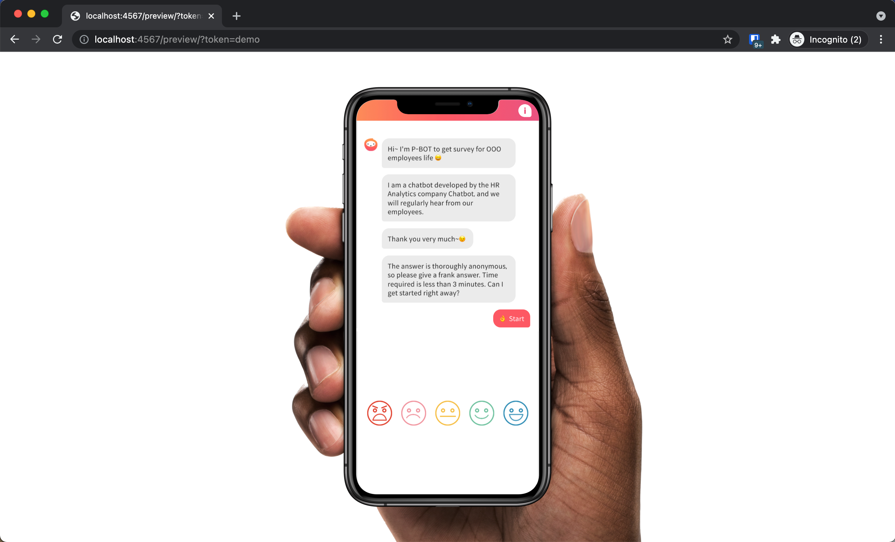

# chatbot-front

It's a React project based on Framer X (v31 ~ 51)

I used Framer X like a React Studio, so all components are visible in the same way. It enables more organized and maintainable projects.

## Prerequisites

To run this project, you need Framer X Desktop client (v31 ~ 51) on mac.

[Download Framer v51](https://drive.google.com/file/d/1S_YCwKKQ64u7vhQcXBP7g7Xg2IZGp0sw/view?usp=sharing)

## Development

1. Clone this repository

2. Compile `src` codes with `yarn start`

3. Open the `.fx` file with Framer X.

4. You can use the dev server (http://localhost:4567/preview) automatically.

5. For the demo, using the demo token http://localhost:4567/preview/?token=demo

## Deployment & Demo

Export it then deploy like static websites.

https://framer-chatbot.vercel.app/?token=demo
